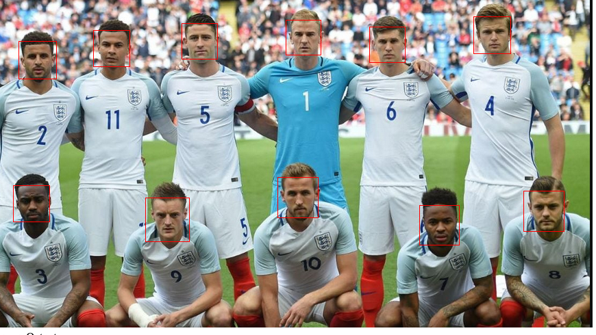
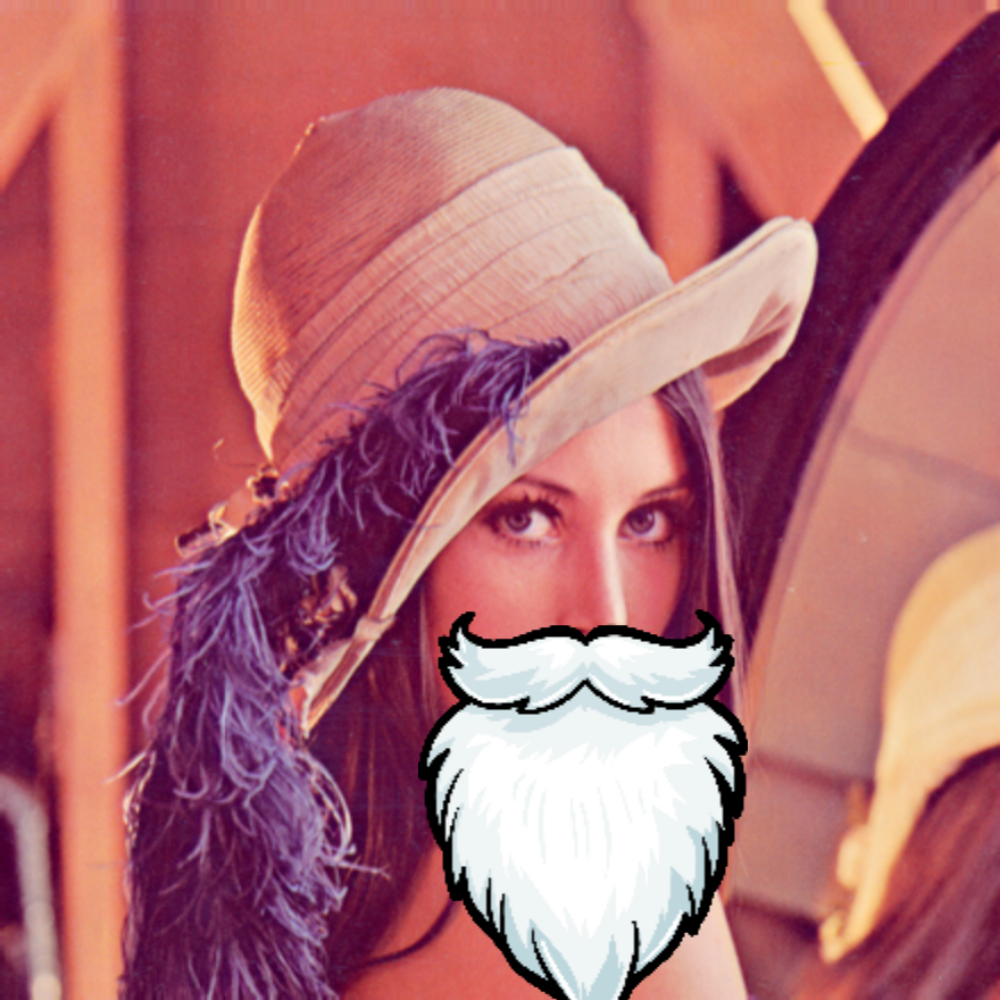

# Christmas Converter

## Holidays, but with deception

Christmas converter is a website to add some Christmas Cheer to all your photos. During the difficult times of COVID, friends and family are unable to join together and celebrate the holidays. One way to deal with this problem is to fake some Christman photos. Provide an image to the website from your computer (Hit the "Browse" button) and choose the cosmetics you would like to add to your photos. After that, click "Click me" and the website will return the same photo, but with a bit of the Christmas spirit! Santa's hat and beard and elf hats can be added to your photos. Even if you can't celebrate Christmas together, you can certainly pretend you did!

This website uses OpenCVJS for face-detection using haar-classifiers. Once faces are detected, the bounding box for each face will be provided and the necessary hats and beards will be applied accordingly using p5.js. 

Read our documentation **[here](https://jackliu612.github.io/HackUMass/js/out/index.html)** 
## How it works

The first step is to detect the faces in a given image. This was done using OpenCV.js for face-detection with haar-classifiers. The result of this ML classifier is a bounding box for each visible face. An example can be seen here:  
Once the bounding box for each face is acquired, it is then a simple process of scaling and positioning the appropriate hat and accessory images onto the image. This is then displayed to a HTML canvas element using the p5.js library.  
## Self-hosting instructions

The website is hosted on github pages and is available at [https://jackliu612.github.io/HackUMass/](https://jackliu612.github.io/HackUMass/).
Furthermore, the complete JSDoc documentation can be found at [https://jackliu612.github.io/HackUMass/js/out/index.html](https://jackliu612.github.io/HackUMass/js/out/index.html).

If you would like to run it on your own machine first download the repository and run it as a static server (install the npm package "static-server" and run "static-server" in Command Line). Go to the localhost on the given port (default 8000) and the website will function locally. 

## Examples

